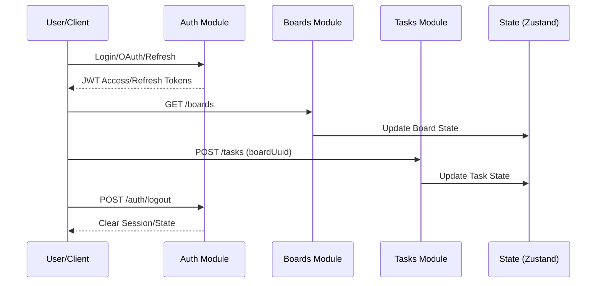

# Public Interface & Contracts

## Interface Map



## Endpoints / Exports

All HTTP interactions are mediated via [[src/lib/http/http.js]] using the `api` client instance.

| Method | Path | Source File | Auth Required |
| :--- | :--- | :--- | :--- |
| POST | `/auth/login` | [[src/features/auth/api/login/loginUser.js]] | No |
| POST | `/auth/refresh` | [[src/features/auth/api/refresh/refreshToken.js]] | No (Refresh Token) |
| POST | `/auth/oauth/github` | [[src/features/auth/api/github/connect/githubAuth.js]] | No |
| POST | `/boards` | [[src/features/boards/api/createBoard.js]] | Yes |
| GET | `/boards` | [[src/features/boards/api/getBoards.js]] | Yes |
| POST | `/users` | [[src/features/user/api/create/createUser.js]] | No |
| PATCH | `/users` | [[src/features/user/api/update/updateUser.js]] | Yes |

> [!WARNING]
> The repository relies heavily on `zustand` stores ([[src/features/auth/store/authStore.js]], [[src/features/boards/store/boardStore.js]], [[src/features/tasks/store/taskStore.js]]) for data synchronization. Direct API calls bypass store consistency checks unless wrapped in the corresponding hook or store action.

## Data Models

### User DTO
Used in [[src/features/user/api/get/getUser.js]] and [[src/features/user/store/userStore.js]].

```json
{
  "uuid": "string",
  "login": "string",
  "email": "string",
  "avatarUrl": "string|null",
  "googleOAuthEnabled": "boolean",
  "githubOAuthEnabled": "boolean",
  "yandexOAuthEnabled": "boolean",
  "telegramEnabled": "boolean"
}
```

### Board DTO
Used in [[src/features/boards/api/getBoards.js]].

```json
{
  "uuid": "string",
  "title": "string",
  "color": "string",
  "createdAt": "ISO8601String",
  "updatedAt": "ISO8601String",
  "isPinned": "boolean",
  "isFavorite": "boolean"
}
```

## Contract Risks

- **Unresolved Dependencies**: A significant number of imports (269) remain unresolved in the static analysis context (e.g., `[[src/common/data/index.js]]` referencing `./filterAndSortData`). This suggests high reliance on index-file barrel exports that may be fragile or misconfigured.
- **WebSocket Stability**: WebSocket initialization in [[src/lib/ws/ws.js]] is singleton-based but relies on an external token injection pattern that lacks explicit error handling for connection race conditions during auth token refresh.
- **Data Validation**: Schemas are scattered across `[[src/features/auth/validators/]]` and `[[src/features/user/validators/]]`. There is no global DTO validation layer, leading to potential discrepancies between client-side form validation and server-side expectations.

# OpenAPI Specification


> [!NOTE]
> The OpenAPI spec above is a distilled representation of observed HTTP route definitions in [[src/config/routes.js]] and feature-level API modules. It does not represent the full operational surface area.